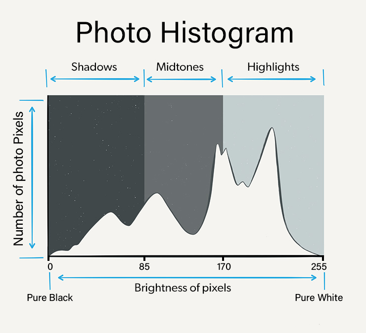
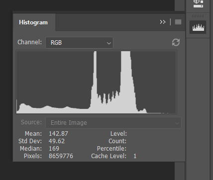
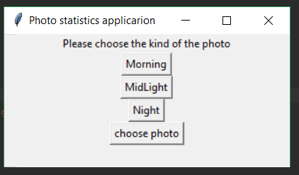
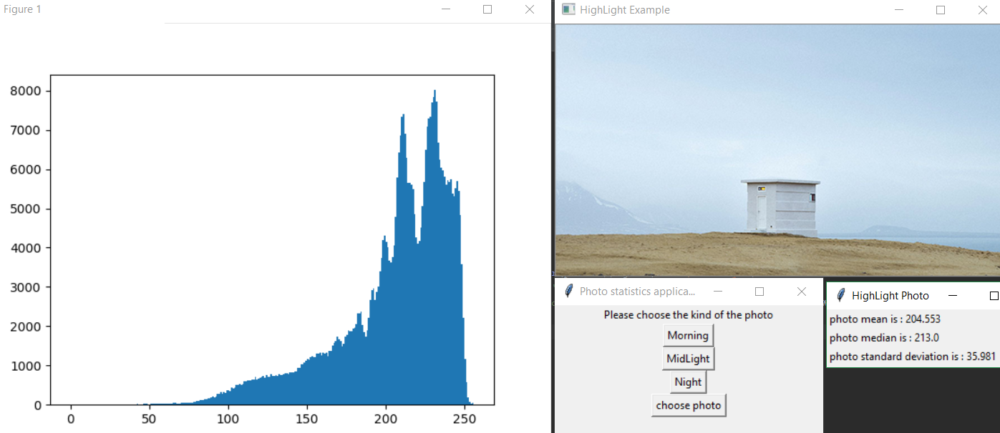
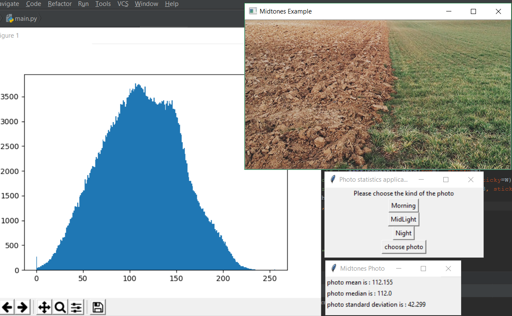
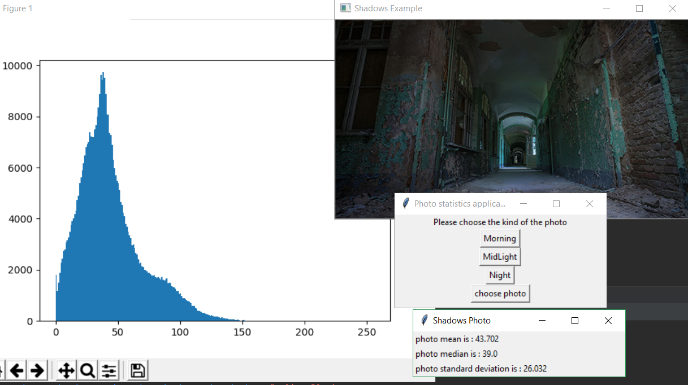
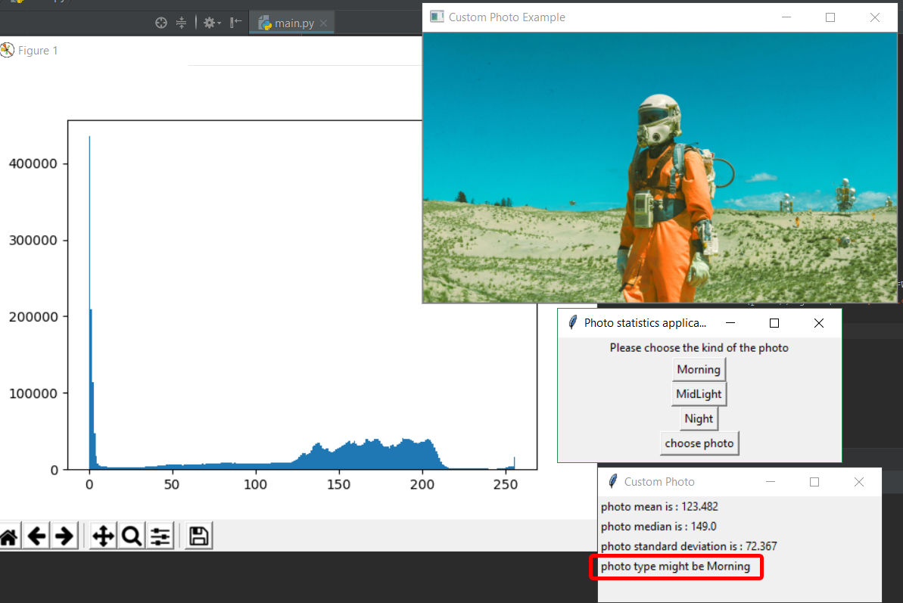
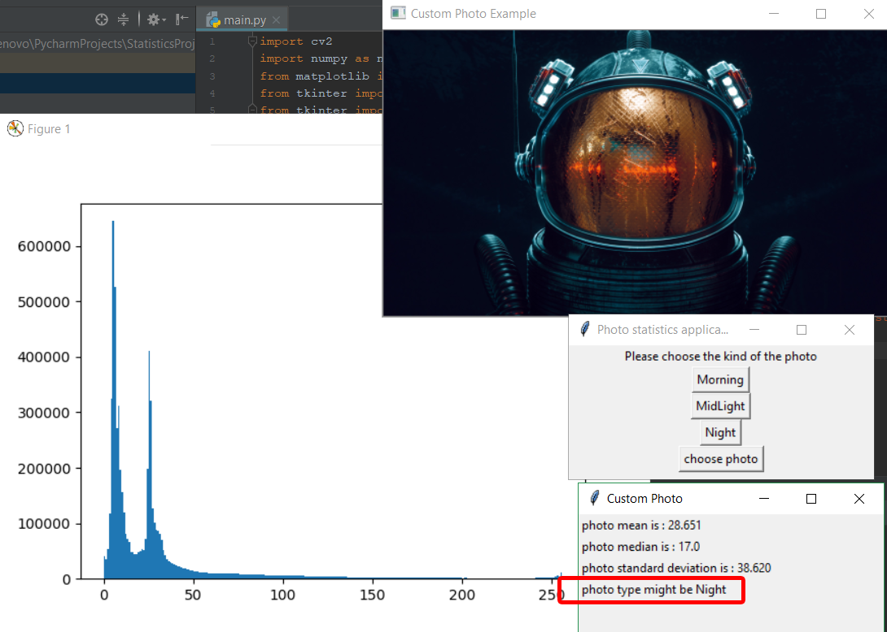

# image day time prediction
In this project we calculated the histogram, mean, median and standard deviation for photo color values and try to make prediction based on median value of the photo pixels to decide if it is a morning photo or a night photo.

## Photo Histogram

	

Reading the histogram of the photo is so simple, pixels that has brightness values from 0 to 85 is considered shadows, from 85 to 170 is considered Midtones and from 170 to 255 is considered Highlights.
Generally, photo histogram, mean, median and standard deviation is used in photo editing softwares to help you more understand photo color values.

	

## Prerequisites
* matplotlib: to view the histogram
* cv2: to read the photo
* numpy: to apply statical operations on photo pixels
* tkinter: for the GUI

## Run
In the program interface you have the ability to choose one of 3 available photos: Morning photo (Highlight), Mid-light photo (Midtones), Night photo (Shadows) or you can choose a custom photo.

	

in the Morning photo we can see that histogram color values are concentrated in the highlight range

	

in the Mid-light photo histogram color values are concentrated in the Midtones range

	

in the Night photo histogram color values are concentrated in the Shadows range

	

also custom photo can be choosen and the program will predict if it is a morning photo or a night photo based on median value

	
	

